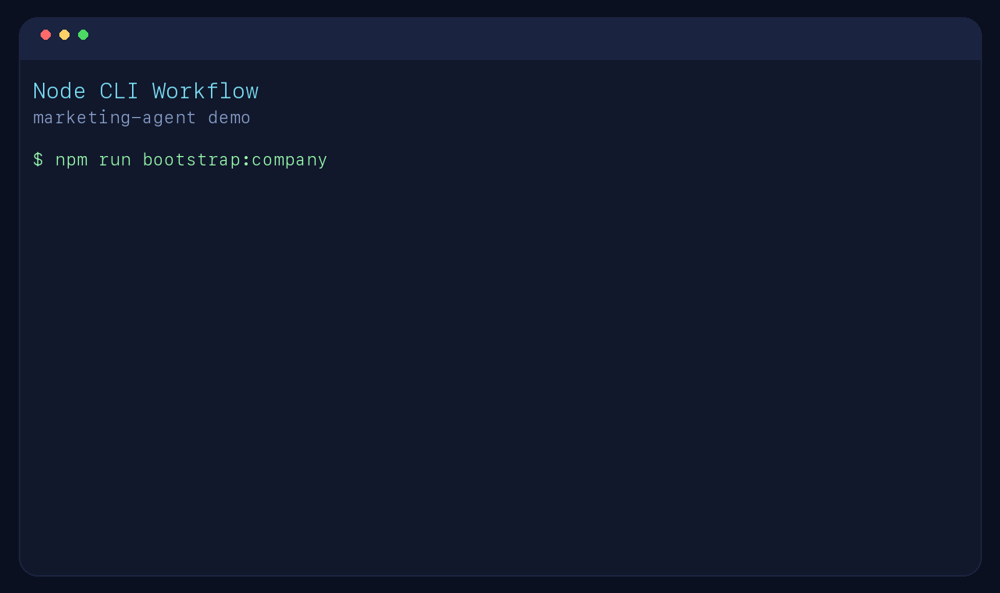
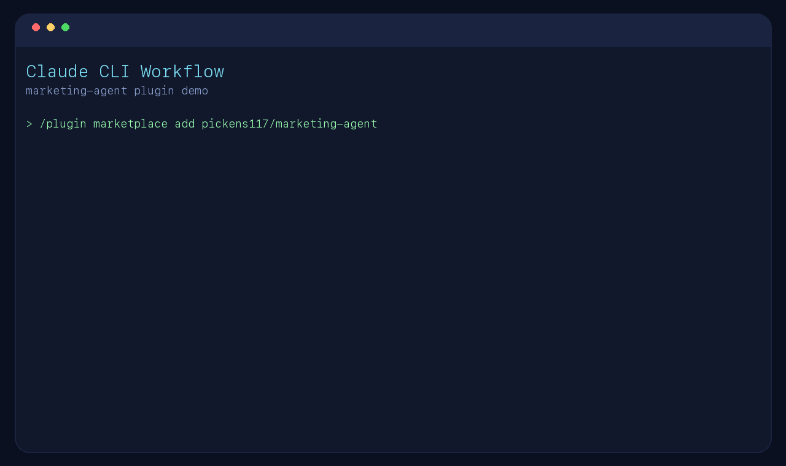

# Marketing Agent

A Claude Agent SDK starter built for marketing teams that want practical help using AI effectively.

Open source under the MIT License, so anyone can use, modify, and share it.

This repo is designed to work in three ways:

- as a standalone Node CLI built on the Claude Agent SDK
- as a repo-local Claude Code setup with skills and agents
- as a shareable Claude Code plugin marketplace that anyone with the Claude CLI can install

## Quick Start

Use the Node CLI:

```bash
npm install
export ANTHROPIC_API_KEY="your-api-key"
npm run bootstrap:company
npm run agent -- --workflow-list
npm run agent -- --workflow campaign-brief "Create a launch brief for our new feature."
```

Use the Claude CLI plugin:

```text
/plugin marketplace add pickens117/marketing-agent
/plugin install marketing-ai-enablement-plugin@marketing-agent-marketplace
/campaign-brief Launch a new AI reporting feature for mid-market SaaS marketing teams
```

## Demo



### Claude CLI Demo



The agent is tuned to support:

- campaign ideation and positioning
- audience and message refinement
- content planning and repurposing
- experimentation frameworks and measurement
- workflow design for safe, repeatable AI use
- review of prompts, briefs, and go-to-market plans

## What It Does

This project provides a small TypeScript CLI around the Claude Agent SDK. It gives your team a reusable marketing-focused agent instead of starting every session from a blank prompt.

The default behavior is opinionated:

- pushes for business context before generating tactics
- recommends experiments, not just copy
- calls out brand, legal, and data-quality risks
- prefers measurable next steps over generic AI advice
- can delegate to built-in specialist subagents for strategy, content, analytics, and enablement ops

## Setup

1. Install Node.js 18 or newer.
2. Install dependencies:

```bash
npm install
```

3. Set your Anthropic API key:

```bash
export ANTHROPIC_API_KEY="your-api-key"
```

4. Run the full verification suite:

```bash
npm run verify
```

5. Regenerate plugin prompt assets from the canonical prompt source when prompt content changes:

```bash
npm run generate:plugin
```

Note: this repo is open source and shareable, but `"private": true` remains in `package.json` to prevent accidental npm publishing.

## Run It

Use a one-off prompt:

```bash
npm run agent -- "Create a Q2 launch plan for a new B2B analytics product aimed at VP Marketing."
```

Start interactive mode:

```bash
npm run chat
```

Use a built-in workflow:

```bash
npm run agent -- --mode workflow "Help our demand gen team build an AI-assisted webinar promotion workflow."
```

Use a custom company context file:

```bash
npm run agent -- --context-path ./docs/company/company-context.md "Create a message testing plan for our Q3 campaign."
```

Get machine-readable output:

```bash
npm run agent -- --json "Create a lightweight AI enablement plan for our content team."
```

Use a structured workflow pack:

```bash
npm run agent -- --workflow experiment-plan "Design a LinkedIn messaging test for our new product launch."
```

Save an output artifact:

```bash
npm run agent -- --workflow campaign-brief --out outputs/launch-brief.md "Create a launch brief for our new feature."
```

Review the result before using it:

```bash
npm run agent -- --workflow campaign-brief --review "Create a launch brief for our new feature."
```

Chain into the next recommended workflow:

```bash
npm run agent -- --workflow campaign-brief --chain "Create a launch brief for our new feature."
```

Bootstrap starter company files:

```bash
npm run bootstrap:company
```

List available workflow packs:

```bash
npm run agent -- --workflow-list
```

Show CLI help:

```bash
npm run agent -- --help
```

## Modes

- `coach`: default mode for broad marketing guidance
- `campaign`: sharper campaign strategy and messaging support
- `workflow`: focused on AI process design, tooling, and enablement

## Workflow Packs

The CLI now supports stronger workflow-specific output contracts with `--workflow`:

- `general`: flexible default guidance
- `campaign-brief`: structured campaign brief
- `email-sequence-plan`: email sequence planning with CTA and measurement guidance
- `landing-page-brief`: landing page planning with message match and conversion guidance
- `campaign-postmortem`: campaign retrospective with learnings and follow-up experiments
- `content-brief`: content planning with angle, outline, distribution, and CTA guidance
- `sales-enablement-kit`: sales enablement planning with proof points, objections, and talk tracks
- `linkedin-ad-plan`: LinkedIn ad planning with format, placement, copy, and measurement guidance
- `meta-ad-plan`: Meta ad planning with format, placement, creative, and measurement guidance
- `message-house-check`: messaging review against approved positioning
- `content-repurpose`: content repurposing plan
- `experiment-plan`: test plan with thresholds and decision rules
- `ai-governance-checklist`: AI governance checklist for marketing workflows
- `ai-adoption-plan`: team rollout plan for AI adoption

## Output Style

The agent is instructed to produce:

- concise recommendations
- assumptions called out explicitly
- suggested prompts or templates when useful
- experiments, KPIs, and next steps

## Subagents

The main agent can delegate to specialist subagents when a task needs deeper support in a specific area:

- `strategist`: campaign strategy, audience selection, positioning, offer design, and messaging architecture
- `content_lead`: content planning, repurposing ideas, editorial angles, and prompt-ready creative briefs
- `analyst`: measurement plans, funnel diagnostics, testing frameworks, and campaign performance interpretation
- `enablement_ops`: AI workflow design, governance, prompt libraries, QA checklists, and team enablement programs

If you are using Claude Code in this repo, the project also includes a shared marketing subagent:

- `marketing-ai-enablement`: a Claude project subagent focused on helping marketing teams use AI effectively for campaign strategy, content planning, workflow design, prompt improvement, and team enablement

## Company Context

This project is structured so the marketing agent stays reusable, while company-specific context lives in separate files.

The main entrypoint is:

- `docs/company/company-context.md`

That file should summarize the company and point to supporting materials such as:

- `docs/company/brand-guidelines.md`
- `docs/company/message-house.md`
- `docs/company/personas.md`
- `docs/company/team-preferences.md`
- files from `docs/company/example-pack/` if you want example research and legal materials

Starter templates are included for:

- `docs/company/brand-guidelines.md`
- `docs/company/message-house.md`
- `docs/company/personas.md`

The Node agent will load `docs/company/company-context.md` automatically when it exists and use it to ground recommendations in the company's brand voice, messaging, audience, and constraints.

The Claude Code skill is also written to look for that file before giving company-specific guidance.

The context loader also supports lightweight frontmatter metadata like `category`, `priority`, and `tags` in the company files to help target the right context for each workflow.

You can also add team-level guidance in:

- `docs/company/team-preferences.md`

This is useful for recurring preferences like preferred channels, KPI style, approval habits, and experimentation tolerance.

## Share With Claude CLI Users

This repo now includes a Claude Code plugin marketplace and a reusable plugin:

- marketplace file: `.claude-plugin/marketplace.json`
- plugin: `plugins/marketing-ai-enablement-plugin`

To test locally:

```bash
claude --plugin-dir ./plugins/marketing-ai-enablement-plugin
```

To add the local marketplace and install the plugin from Claude Code:

```text
/plugin marketplace add .
/plugin install marketing-ai-enablement-plugin@marketing-agent-marketplace
```

To share it with others, publish this repository to GitHub and tell users to run:

```text
/plugin marketplace add pickens117/marketing-agent
/plugin install marketing-ai-enablement-plugin@marketing-agent-marketplace
```

After installation, users can invoke the plugin's agent, use its slash commands, or let Claude use the skill when tasks match.

Included plugin commands:

- `/campaign-brief`: generates a structured marketing campaign brief
- `/ai-adoption-plan`: creates a practical AI rollout plan for a marketing team
- `/email-sequence-plan`: creates an email sequence plan with message progression and measurement guidance
- `/landing-page-brief`: creates a landing page brief with CTA and conversion guidance
- `/campaign-postmortem`: creates a campaign postmortem with learnings and next steps
- `/content-brief`: creates a content brief with angle, outline, distribution, and CTA guidance
- `/sales-enablement-kit`: creates a sales enablement kit with proof points and talk tracks
- `/linkedin-ad-plan`: creates a LinkedIn ad plan with format, placement, copy variants, and measurement guidance
- `/meta-ad-plan`: creates a Meta ad plan with format, placement, creative variants, and measurement guidance
- `/message-house-check`: reviews messaging against approved positioning
- `/content-repurpose`: creates a repurposing plan from a source asset or topic
- `/experiment-plan`: builds a test plan with metrics and decision thresholds
- `/ai-governance-checklist`: generates a practical AI governance checklist
- `/content-calendar`: creates a lightweight channel-aware content calendar
- `/persona-brief`: creates or refines a persona brief
- `/launch-checklist`: creates a launch readiness checklist
- `/prompt-improve`: rewrites a marketing prompt for better outputs

## Example Claude CLI Workflow

One simple Claude Code workflow for a marketing team could look like this:

1. Add the marketplace and install the plugin:

```text
/plugin marketplace add pickens117/marketing-agent
/plugin install marketing-ai-enablement-plugin@marketing-agent-marketplace
```

2. Open Claude Code in a project that has company context in `docs/company/`.

3. Generate a launch brief:

```text
/campaign-brief Launch a new AI reporting feature for mid-market SaaS marketing teams
```

4. Create a LinkedIn ad plan:

```text
/linkedin-ad-plan Promote our new AI reporting feature to VP Marketing and demand gen leaders
```

5. Create a Meta ad plan:

```text
/meta-ad-plan Generate awareness and leads for our new AI reporting feature launch
```

6. Refine the messaging:

```text
/message-house-check We help marketers automate reporting completely with zero analyst effort.
```

7. Create the rollout plan for the team:

```text
/ai-adoption-plan Roll out AI-assisted workflows for our content and demand gen teams this quarter
```

8. If needed, improve a working prompt before handing it to the team:

```text
/prompt-improve Write five LinkedIn posts about our product launch.
```

## Example Workflow

Here is one practical way a marketing team could use the agent for a new campaign:

1. Start in `campaign` mode and ask for the launch strategy.

```bash
npm run agent -- --mode campaign "We are launching a new AI analytics feature for B2B SaaS marketers. Create a campaign strategy for pipeline generation."
```

2. Use the output to refine positioning, audience segments, channels, and success metrics.

3. Ask the agent to develop content angles and assets.

```bash
npm run agent -- --mode campaign "Using that strategy, create three webinar angles, five LinkedIn post concepts, and an email sequence outline."
```

4. Switch to `workflow` mode to design the team process for producing and reviewing AI-assisted content.

```bash
npm run agent -- --mode workflow "Create a lightweight workflow for drafting, reviewing, and approving AI-assisted campaign content across demand gen and content marketing."
```

5. Use the recommendations to create a repeatable operating playbook with prompts, QA checks, owners, and KPIs.

If your focus is paid social specifically, a good Node CLI flow is:

```bash
npm run agent -- --workflow linkedin-ad-plan "Create a LinkedIn ad plan for our AI reporting feature."
npm run agent -- --workflow meta-ad-plan "Create a Meta ad plan for our AI reporting feature."
npm run agent -- --workflow experiment-plan "Design creative and messaging tests for our LinkedIn and Meta ads."
```

If you are using Claude Code instead of the Node CLI, you can also work through the same flow by invoking the project subagent directly:

```text
Use the marketing-ai-enablement subagent to help me build a campaign launch plan and an AI-assisted content workflow for the team.
```

## Project Structure

- `src/index.ts`: CLI entrypoint
- `src/agent.ts`: Claude Agent SDK integration
- `src/system-prompt.ts`: marketing-team system prompt and mode presets
- `src/subagents.ts`: specialist marketing subagents the main agent can delegate to
- `src/workflows.ts`: workflow packs, output contracts, and validation rules
- `scripts/`: plugin generation and evaluation scripts
- `evals/`: standard and red-team evaluation cases
- `examples/workflows/`: example workflow outputs
- `templates/company-starter/`: starter company context files
- `plugins/marketing-ai-enablement-plugin/`: shareable Claude Code plugin
- `.claude-plugin/`: local plugin marketplace definition

## Notes

The project includes a `verify` script that runs:

```bash
npm run build
npm run test
npm run generate:plugin
claude plugin validate .
claude plugin validate ./plugins/marketing-ai-enablement-plugin
```

GitHub Actions CI is configured in [`.github/workflows/verify.yml`](/Users/stephenpickens/Development/marketing-agent/.github/workflows/verify.yml) and runs `npm run verify` plus `npm run eval` on pushes and pull requests.

There is also an evaluation harness in [`evals/cases.json`](/Users/stephenpickens/Development/marketing-agent/evals/cases.json) and [`scripts/evaluate.ts`](/Users/stephenpickens/Development/marketing-agent/scripts/evaluate.ts). Run it with:

```bash
npm run eval
```

If `ANTHROPIC_API_KEY` is set, it runs live agent evaluations. Otherwise it performs a dry-run quality check against the eval cases.

The eval suite also includes red-team cases in [`evals/red-team.json`](/Users/stephenpickens/Development/marketing-agent/evals/red-team.json) for risky claims, privacy issues, and unsafe workflow requests.

Example workflow fixtures live in [`examples/workflows`](/Users/stephenpickens/Development/marketing-agent/examples/workflows) so users can see the intended output shape quickly.

## License

MIT. See [`LICENSE`](/Users/stephenpickens/Development/marketing-agent/LICENSE).
